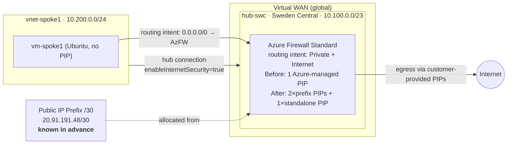

# vWAN secured hub — Azure Firewall customer-provided PIP prefix lab

Lab evidence for using **customer-provided Public IP addresses (from a Public IP Prefix)** on an **Azure Firewall in a Virtual WAN secured hub** — the officially supported path to scale SNAT port capacity when you need the egress IPs to be **known in advance** so that downstream systems can allow-list them.

> **Environment caveats — results are specific to this configuration:**
> - Azure Firewall **Standard** SKU, type **AZFW_Hub** (secured vWAN hub firewall)
> - Region **Sweden Central** (`swedencentral`)
> - Default hub sizing (`/23` hub address prefix), routing intent enabled for **Private + Internet**, default autoscale
> - Test date: 2026-04-23
>
> Timings (Deallocate / Allocate) will vary with region capacity, firewall scale-unit count, SKU (Premium), hub size and current load. Treat the ~18 min total / ~6 min data-plane outage numbers below as a **directional lower bound** rather than an SLA.

---

## Scenario

This lab addresses a common pattern: a workload behind an Azure Firewall in a Virtual WAN secured hub hits **SNAT-port exhaustion** on internet-bound traffic, and needs **more public IPs** to scale the SNAT port budget.

The extra constraint modelled here is that the **egress IPs must be known in advance** — typical when downstream systems (SaaS APIs, partner endpoints, compliance appliances) rely on allow-listing specific source IPs. Adding PIPs reactively doesn't work if consumers of the traffic need to update their allow-lists first.

This lab validates the feature designed for that case: **[Customer-provided public IP address support in secured hubs](https://learn.microsoft.com/en-us/azure/firewall/secured-hub-customer-public-ip)**. Allocate a Public IP Prefix up-front, publish the range to downstream consumers, let them update filtering rules on their own schedule, then cut the firewall over during a maintenance window.

---

## TL;DR findings

| # | Question | Answer (evidenced in this repo) |
|---|----------|---------------------------------|
| 1 | Does a baseline spoke VM in a vWAN secured hub egress via the firewall's Azure-managed PIP? | **Yes.** Spoke VM ➜ `curl api.ipify.org` returned `4.223.66.239` which matched the AzFW PIP. |
| 2 | Can customer-provided PIPs (allocated from a /30 Public IP Prefix) replace the Azure-managed PIP on a secured-hub firewall? | **Yes.** After the swap, egress IP was `20.91.191.48` — inside prefix `20.91.191.48/30`. |
| 3 | Can you add the new prefix PIPs **in parallel** with the existing Azure-managed PIP (zero-downtime, add-only)? | **No.** ARM rejects any PATCH of `properties` on a running firewall: `OnlyTagsSupportedForPatch`. Only `tags` can be patched online. |
| 4 | Is the [Microsoft Learn](https://learn.microsoft.com/en-us/azure/firewall/secured-hub-customer-public-ip) "set `count=0` → `Deallocate` → `Allocate`" the only path? | **Yes.** It's the only API shape that works for this change, and MS Learn is explicit: *"you have to remove all the public IPs assigned to the Hub, stop/deallocate the hub firewall, and allocate the Firewall with your public IP during scheduled maintenance hours."* |
| 5 | Can you at least **re-attach the original Azure-managed PIP alongside** the new prefix PIPs after the swap (creative workaround)? | **No.** The original Azure-managed PIP is released back to Azure's pool on Deallocate — you don't own it and can't re-cite it. The firewall's PIP model is also **either** `hubIPAddresses` (Azure-managed) **or** `ipConfigurations[]` (customer-provided) — they can't be mixed on one firewall. |
| 6 | Does adding a 3rd customer-PIP from a **different source** (a standalone static PIP, not from the prefix) alongside the 2 prefix PIPs work? | **Yes** — all 3 end up in `ipConfigurations[]` and traffic distributes across them. Multi-source customer PIPs coexist fine as long as all are customer-owned Standard/static. This means you can keep growing SNAT capacity over time with additional standalone PIPs without re-using the prefix — but each addition still requires a Deallocate/Allocate cycle. |
| 7 | How long is the outage during the swap? | **~17m47s control plane** (Deallocate 9m43s + Allocate 8m04s). Data-plane outage observed ≥ **6m23s** contiguous, with egress effectively failing for most of the window (~90% of samples failed during the swap). **Plan a ≥20 min maintenance window.** |
| 8 | Can NAT Gateway be used with the firewall in a vWAN secured hub to scale SNAT (as it can be with standalone AzFW)? | **No — not possible, not in preview (verified April 2026).** The firewall's subnet (`AzureFirewallSubnet`) is in a Microsoft-managed VNet and not exposed to your tenant, so the subnet-level NAT GW attachment literally has nowhere to land. Explicitly called out in [NAT-GW integration docs](https://learn.microsoft.com/en-us/azure/firewall/integrate-with-nat-gateway#azure-firewall-and-nat-gateway-limitations) and the [vWAN FAQ](https://learn.microsoft.com/en-us/azure/virtual-wan/virtual-wan-faq). |

---

## Topology



---

## Scripts

Numbered to match the phases in [`docs/RESULTS.md`](docs/RESULTS.md):

| Script | Phase | What it does |
|--------|-------|--------------|
| `scripts/00-vars.sh` | — | Shared env (sub, region, RG, naming). |
| `scripts/01-deploy-core.sh` | 1 | vWAN + hub + AzFW Standard + routing intent (Private + Internet). |
| `scripts/02-deploy-spoke.sh` | 2 | Spoke VNet + Ubuntu VM + hub connection with `enableInternetSecurity`. |
| `scripts/03-baseline-test.sh` | 3 | Curl against multiple IP-echo services (ipify + ifconfig.me + icanhazip) to confirm egress IP matches the AzFW PIP. |
| `scripts/04-custom-pip-prefix-add-attempt.sh` | 4 | Creates `/30` Public IP Prefix, pre-allocates 2 PIPs, and **attempts online PATCH** to add them alongside the existing PIP — captures the `OnlyTagsSupportedForPatch` ARM error. |
| `scripts/05-swap.ps1` | 5 | PowerShell. Deallocate/Allocate swap per [MS Learn](https://learn.microsoft.com/en-us/azure/firewall/secured-hub-customer-public-ip). |
| `scripts/06-verify-egress-new-pip.sh` | 6 | Post-swap egress check — IP must fall inside the prefix. |
| `scripts/99-teardown.sh` | 9 | `az group delete` — AzFW secured-hub burns ~USD 37/day, don't leave it running. |

A convenience wrapper `deploy.sh` chains 01 → 02 → 03 → 04 → 05 → 06 → 07.

### Running it yourself

```bash
az login            # or: az login --identity  (system-assigned MI with Contributor)
az account set -s <sub>
# Optionally override region/RG/hub CIDR at the top of scripts/00-vars.sh
bash deploy.sh
pwsh ./scripts/05-swap.ps1          # swap to customer prefix PIPs
bash  scripts/06-verify-egress-new-pip.sh
# ...when done...
bash scripts/99-teardown.sh
```

PowerShell prerequisites: `Az.Accounts` and `Az.Network` modules installed — `Install-Module Az.Accounts,Az.Network -Scope CurrentUser -Force`.

---

## Results summary (full detail in [`docs/RESULTS.md`](docs/RESULTS.md))

**Baseline:** VM in `vnet-spoke1` → `api.ipify.org` returned **`4.223.66.239`** = AzFW's Azure-managed PIP. ✔

**Online-parallel attempt (PATCH):**
```
ERROR: (OnlyTagsSupportedForPatch) PATCH request content includes properties property.
       Only tags property is currently supported.
```
Reproduced whether the new PIPs came from a prefix or a standalone allocation — the block is on the `properties` PATCH, not PIP source.

**Swap via `Deallocate` + `Allocate` (PowerShell):** succeeded. Post-swap:
```
ipConfigurations:
  AzureFirewallIpConfiguration0 -> pip-fw-prefix-1    20.91.191.48
  AzureFirewallIpConfiguration1 -> pip-fw-prefix-2    20.91.191.49
  AzureFirewallIpConfiguration2 -> pip-fw-standalone  4.223.83.37
hubIPAddresses:
  null    <-- gotcha, see below
```

Post-swap egress IPs from the spoke VM distributed across all three PIPs (observed `20.91.191.48`, `20.91.191.49`).

**Observed downtime (Standard SKU, Sweden Central, default sizing, ~2 Hz probe):**

| Metric | Value |
|---|---|
| Control-plane swap total | **17 min 47 s** (Deallocate 9m43s + Allocate 8m04s) |
| First failed curl | **+6.9 s** after Deallocate start |
| Longest contiguous data-plane outage | **≥ 6 min 23 s** |
| Curl success rate during swap window | **~10 %** |
| Stable egress restored | ~immediately after Allocate completed |

**Plan a ≥20 min maintenance window.** The outage is real and material — this is not a seamless online swap.

---

## Important gotcha — `hubIPAddresses` vs `ipConfigurations`

After moving to customer-provided PIPs, the firewall's ARM shape changes:

```jsonc
// Before (Azure-managed PIPs)
"hubIPAddresses": {
  "publicIPs": { "addresses": [{ "address": "4.223.66.239" }], "count": 1 }
},
"ipConfigurations": []

// After (customer-provided PIPs)
"hubIPAddresses": null,
"ipConfigurations": [
  { "name": "AzureFirewallIpConfiguration0", "properties": { "publicIPAddress": { "id": "/.../pip-fw-prefix-1" } } },
  { "name": "AzureFirewallIpConfiguration1", "properties": { "publicIPAddress": { "id": "/.../pip-fw-prefix-2" } } },
  { "name": "AzureFirewallIpConfiguration2", "properties": { "publicIPAddress": { "id": "/.../pip-fw-standalone" } } }
]
```

**Tooling / alerts that query `hubIPAddresses` will read `null` after the swap and can produce false negatives** ("firewall has no public IPs!"). Any verification script, dashboard or policy check needs to resolve PIPs via `ipConfigurations[].publicIPAddress.id` when customer-provided PIPs are in play. `scripts/06-verify-egress-new-pip.sh` demonstrates the correct lookup.

---

## Recommendation for scaling SNAT on a secured hub firewall

1. **Pick a target IP count** sized to your expected SNAT needs. A /30 prefix gives 4 usable IPs (≈ 10k SNAT ports per FW instance × autoscale). /29 gives 8. /28 gives 16.
2. **Allocate the Public IP Prefix up-front**, in the **same region** as the hub, with **Standard SKU / static allocation**. The IPs are fixed and visible immediately.
3. **Publish the full prefix range to downstream consumers** that allow-list your egress. Give them time to update filtering rules. The original Azure-managed PIP continues serving traffic while that happens.
4. **Schedule a maintenance window of ≥20 minutes per hub** (can be done hub-by-hub; each hub's swap is independent).
5. **Run the swap** (`scripts/05-swap.ps1` or the MS Learn portal steps). The original Azure-managed PIP is released; downstream consumers can remove it from their allow-lists once they're confident the prefix IPs are in production.
6. **Verify** with `scripts/06-verify-egress-new-pip.sh` — egress IP must be inside the prefix.
7. **Future additions** (standalone PIPs from other sources, or extra prefix PIPs) follow the same Deallocate/Allocate cycle — no online-add exists.

---

## Why NAT Gateway doesn't apply here

Azure Firewall [can be integrated with NAT Gateway](https://learn.microsoft.com/en-us/azure/firewall/integrate-with-nat-gateway) when it's deployed in **your own hub VNet** (classic hub-spoke): NAT GW attaches to `AzureFirewallSubnet`, giving the firewall ~64k SNAT ports per NAT-GW PIP — a much bigger hammer than adding PIPs.

In a **vWAN secured hub** this is not available:
- `AzureFirewallSubnet` lives in a Microsoft-managed VNet invisible to your tenant. There's no ARM path, no portal UI, no CLI flag.
- Docs make this explicit: *"NAT gateway integration isn't currently supported in secured virtual hub network (vWAN) deployments."* ([source](https://learn.microsoft.com/en-us/azure/firewall/integrate-with-nat-gateway#azure-firewall-and-nat-gateway-limitations))
- There is no public preview, no feature flag, no support-ticket path **(verified April 2026)**.

So the **customer-PIP-prefix feature is the only sanctioned lever** for scaling SNAT on a secured-hub firewall today. If NAT-GW-style scaling is genuinely required, the only way there is to re-platform onto a classic hub-spoke VNet with a standalone Azure Firewall — not a cheap change.

---

## References

- [Customer provided public IP address support in secured hubs](https://learn.microsoft.com/en-us/azure/firewall/secured-hub-customer-public-ip) — the feature this lab validates.
- [Public IP address prefix](https://learn.microsoft.com/en-us/azure/virtual-network/ip-services/public-ip-address-prefix) — pre-allocating the range.
- [Azure Firewall SNAT ports & port scaling](https://learn.microsoft.com/en-us/azure/firewall/integrate-with-nat-gateway#why-nat-gateway-with-azure-firewall) — SNAT port math (`2,496` per PIP per instance).
- [Azure Firewall + NAT Gateway limitations](https://learn.microsoft.com/en-us/azure/firewall/integrate-with-nat-gateway#azure-firewall-and-nat-gateway-limitations) — explicit vWAN exclusion.
- [Virtual WAN FAQ](https://learn.microsoft.com/en-us/azure/virtual-wan/virtual-wan-faq) — supported/unsupported combos.
- [What is a secured virtual hub?](https://learn.microsoft.com/en-us/azure/firewall-manager/secured-virtual-hub)
- [Azure Firewall Manager policy overview](https://learn.microsoft.com/en-us/azure/firewall-manager/policy-overview)
